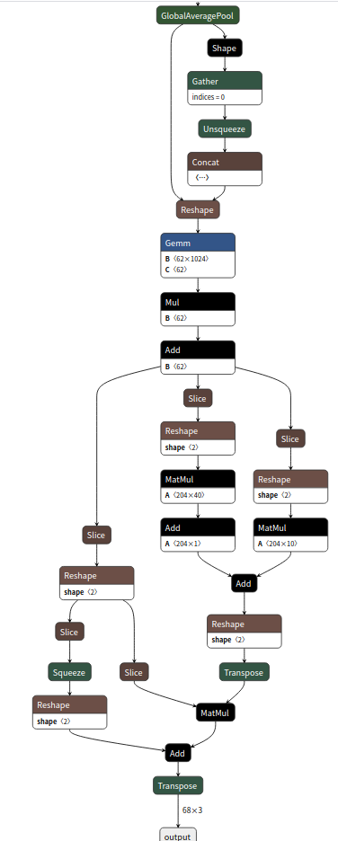
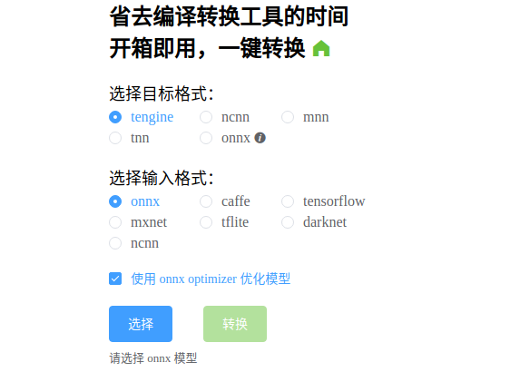
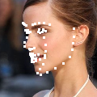

# 3ddfa_v2 cpp实现代码
本项目将3ddfav2模型porting到了c++平台,后端推理框架使用的是MNN.

## 配置

1. clone本项目代码

```bash
git clone https://github.com/lyyiangang/3ddfav2_cpp.git
```
这个项目cpp/third_party目录下有MNN依赖的头文件以及so,如果有必要,你需要下载[MNN](https://github.com/alibaba/MNN)代码自己重编译 .

2. clone 3ddfav2代码
   
```bash
git clone https://github.com/cleardusk/3DDFA_V2.git
```
注意3ddfav2_cpp和3DDFA_V2两个文件夹的层级关系应该为为:
```
root
  |----3ddfav2_cpp
  |----3DDFA_V2
```
按照3DDFA_V2的radme要求配置好python环境以及依赖文件.保证该项目demo能够正常运行

3. 安装CMake
```bash
pip install cmake
```
## 生成ONNX&编译运行
原3ddfav2模型输出的62维的params,需要decode成3d landmark,这里我将decode部分也包含到了网络里,网络能够直接输出landamrk.
步骤:
1. 生成onnx
```python
python face3d_model.py
```
这个脚本会运行三个函数:
```python
original_result(True)
test_compose_model()
ConvertTOOnnx()
```
**original_result**会验证3ddfav2原始代码正确性

**test_compose_model** 会验证decode部分代码合并到模型后代码的正确性

**ConvertTOOnnx** 会生成onnx模型data/face3d.onnx

网络结构如下:



2. 转换成MNN模型
   
   理论上你可以编译MNN源代码生成converter工具,再用这个工具转换,不过这里有一个专门做模型转换的[网站](https://convertmodel.com/)

  

  转换后的MNN模型保存在models目录下.

3. 编译cpp demo
```bash
cd cpp/mnn_demo
mkdir build
cd build
cmake .. && make -j
```
编译完成后运行生成的mnn_demo
```bash
./mnn_demo ../../../models/face3d.mnn ../../../data/roi_face_120x120.png
```
成功运行后会生成```mnn_det_result.png```



注意:
- cpp代码Face3d::Predict的输入必须是120x120x3的bgr图片,这个图片应该是按照3ddfav2的规则crop后并resize到120的.
原python代码crop规则有两个:

```python
if crop_policy == 'box':
    # by face box
    roi_box = parse_roi_box_from_bbox(obj)
elif crop_policy == 'landmark':
    # by landmarks
    roi_box = parse_roi_box_from_landmark(obj)
# ...
img = crop_img(img_ori, roi_box)
img = cv2.resize(img, dsize=(self.size, self.size), interpolation=cv2.INTER_LINEAR)
```
你要根据自己的需要将parse_roi_box_from_bbox或者parse_roi_box_from_landmark实现了.